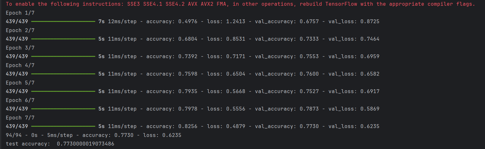
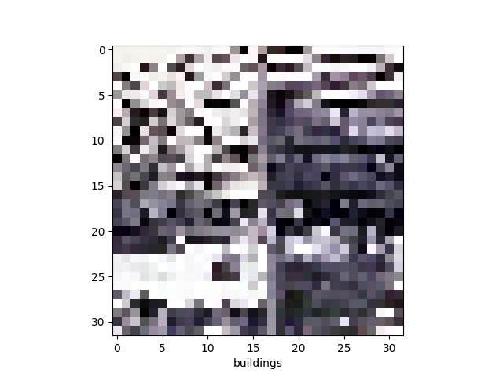

# Image-Classification-CNN

## Overview

This project builds a Convolutional Neural Network (CNN) to classify natural scene images into one of six categories: **buildings**, **forest**, **glacier**, **mountain**, **sea**, and **street**. The model is trained and evaluated using TensorFlow and Keras, and it includes both performance visualization and sample prediction.

## Features

- Custom image dataset loading and preprocessing
- CNN architecture built with TensorFlow/Keras
- Image normalization and data shuffling
- Evaluation of training and validation accuracy/loss
- Visualization of predictions on sample images

## Installation

### Prerequisites

Ensure you have the following installed:

- Python 3.x
- TensorFlow
- NumPy
- Matplotlib

### Install Required Libraries

You can install the necessary libraries using:

```sh
pip install tensorflow numpy matplotlib
```

## Dataset

The dataset is structured as follows:

```
train/
  ├── buildings/
  ├── forest/
  ├── glacier/
  ├── mountain/
  ├── sea/
  └── street/
  
test/
  ├── buildings/
  ├── forest/
  ├── glacier/
  ├── mountain/
  ├── sea/
  └── street/
```

Each subfolder contains corresponding images belonging to that class.

## Workflow

1. Load and resize images to 32x32.
2. Assign labels using folder names.
3. Normalize pixel values to range [0, 1].
4. Shuffle training data.
5. Build and compile a CNN with convolution, pooling, and dense layers.
6. Train the model for 7 epochs using validation data.
7. Evaluate performance on test data.
8. Predict and visualize one example image.

## Output & Visualization

### Training Performance

The model achieved a **test accuracy of ~77.3%**. Accuracy and loss improved steadily over 7 epochs.



### Prediction Example

Below is a sample prediction on a test image. The model’s predicted label is shown on the image, with the expected class printed in the console.



## Contact

For inquiries, contact Mahmoud Afifi at [mahmoudhossam@aucegypt.edu](mailto:mahmoudhossam@aucegypt.edu)
